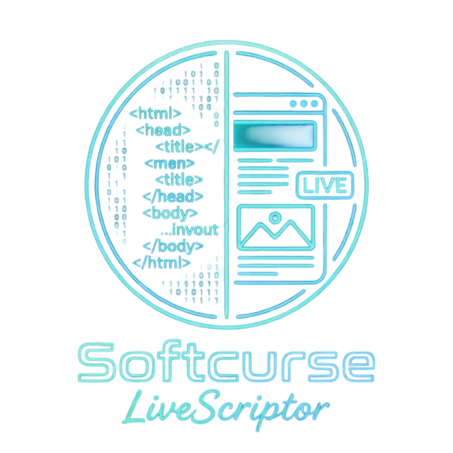

# Softcurse LiveScriptor

A high-performance HTML/CSS/JS live editor powered by Windows Forms and the Monaco Editor (via WebView2) with a dark theme aesthetic. Designed for rapid prototyping with multi-workspace support.

## Key Features
- **Real-Time Preview**: Instant dual-pane rendering with a detachable preview window for multi-monitor setups.
- **CSS Hot Module Replacement**: CSS injections occur without full page reloads via precise DOM diffing.
- **Workspace Explorer**: Recursively load entire project folders, with full context menu support (Create, Rename, Delete).
- **Tabbed Interface**: Manage multiple open files concurrently with dirty state tracking and in-memory persistence.
- **True IntelliSense**: Local Web Worker integration provides deep language parsing for JS/TS/CSS, alongside Emmet abbreviations for HTML.
- **UI & Layout Persistence**: Configurable layouts, splitter ratios, window coordinates, and themes are automatically saved across sessions.

## Build Instructions
1. Clone the repository.
2. Ensure you have the `.NET 9 SDK` installed.
3. Build the application via `dotnet build -c Release` or publish a standalone executable:
   `dotnet publish -c Release -r win-x64 -p:PublishSingleFile=true --self-contained true`
4. Run `LiveScriptor.exe` located in the output folder.
